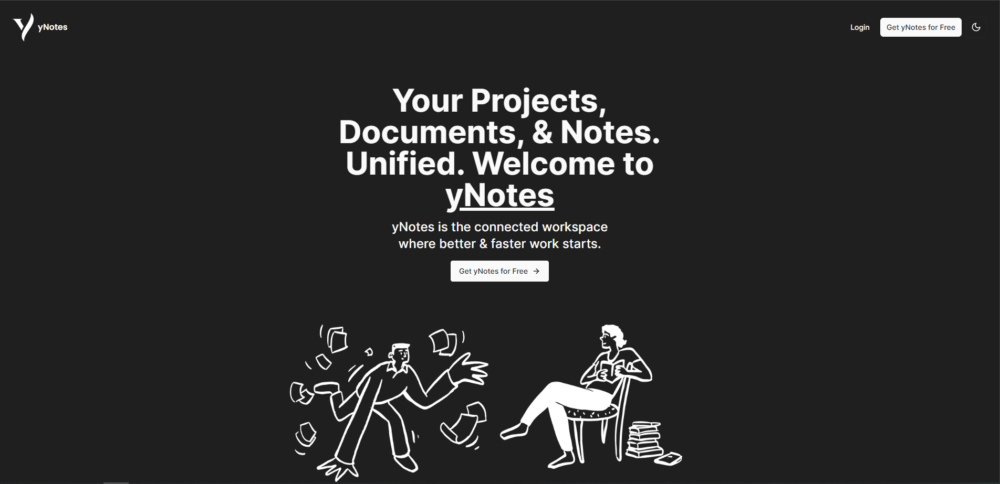

  

# yNotes

yNotes is a Notekeeping application inspired on Notion to start learning NextJS.

## Purpose

- Learning how to use NextJS as a Framework.
- Learning how to use Clerk Authentication, Edgestore & Convex.
- Learning how to use TailwindCSS & Shadui components.

## License

This is a fully open-source project just for me to try and understand above mentioned tools, feel free to use the contents of this repository at your own will.
